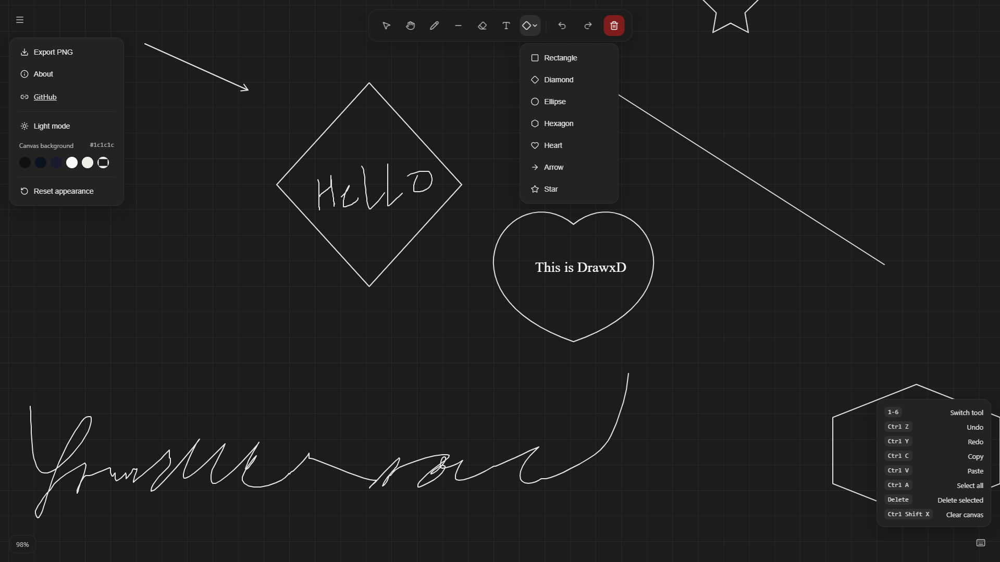

# DrawxD


## Project Overview

DrawxD is a whiteboard canvas inspired from  excalidraw and tldraw. This is an expermention project of mine where I've tried to recreate a modern infinite canvas.

---

### Motivation

When trying to teach somebody a concept online, I normally sketch ideas to help them understand visually, For that I needed an whitebaord app or a website. There werent much good free options and even the good ones had poor performance. Sometimes I just wanted to draw with stylus without internet, but I couldn't find any with infinite canvas, good performance and offline support. 

I created originally created this for my own personal use but later decided to host it online and use it as a hackclub, horizons project. 

I also use this as an opportunity to learn React, as I had less exposure to it.

---

### Live Demo

Project can be run locally by cloning the repository and using vite or directly through the link:

```
https://drawxd.vercel.app/
```

---

### Screenshots



---

## Features

- Infinite Canvas
- Free hand pencil and custom shapes
- Multiple selection options and group movements
- Keyboard shortcuts
- Dark and Light theme
- Customizable canvas background color
- Custom rendering engine

## How It Works

A custom object based rendering engine was built for drawxd. It uses React and HTML Canvas API.

The code base is modular and seperated into different section each or creating shapes, rendering, camera control, shortcuts, grids and many more.

## Tech Stack

- React
- Vite
- HTML5 Canvas API
- JavaScript
- CSS
- Lucide React Icons

---

## Porject structure

```
    drawxd
    ├── README.md
    ├── assets
    ├── index.html
    ├── package-lock.json
    ├── package.json
    ├── public
    ├── src
    │   ├── App.jsx
    │   ├── components
    │   │   └── Toolbar.jsx
    │   ├── engine
    │   │   ├── Canvas.jsx
    │   │   ├── camera.js
    │   │   ├── constants.js
    │   │   ├── grid.js
    │   │   ├── registry.js
    │   │   ├── renderer.js
    │   │   ├── shapeUtils.js
    │   │   ├── shapes
    │   │   │   ├── arrow.js
    │   │   │   ├── diamond.js
    │   │   │   ├── ellipse.js
    │   │   │   ├── heart.js
    │   │   │   ├── hexagon.js
    │   │   │   ├── index.js
    │   │   │   ├── line.js
    │   │   │   ├── pencil.js
    │   │   │   ├── rect.js
    │   │   │   ├── star.js
    │   │   │   └── text.js
    │   │   └── utils.js
    │   ├── main.jsx
    │   └── styles.css
    └── vite.config.js
```
---

## AI Usage

ChatGPT and Claude : I used them occasionally to help me with with creating initial structure, writing complex rendering code and debugging. I also used it to find performance improvements improve code readability and polish the frontend CSS. All features, design decision and final integration were implemented by me.

---

Made for horizons, hackclub
