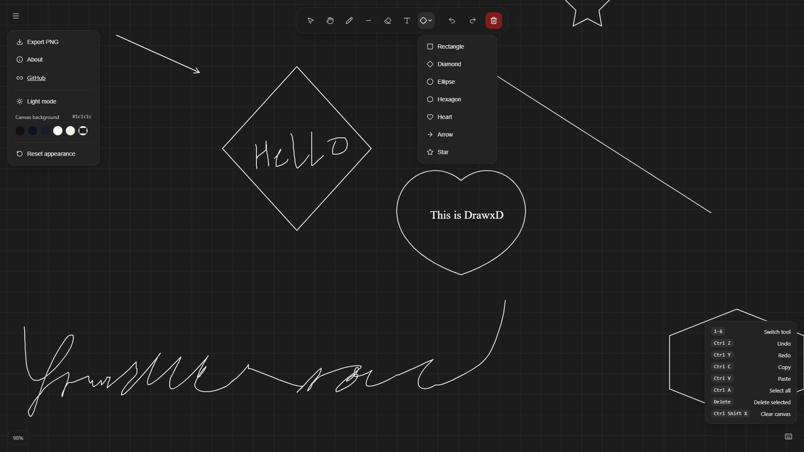

# DrawxD

## Project Overview

DrawxD is a whiteboard canvas inspired by Excalidraw and tldraw. It is an experimental project where I've tried to recreate a modern infinite canvas.

---

### Motivation

When teaching somebody a concept online, I normally sketch ideas to help them understand visually. I wanted a free whiteboard with an infinite canvas, good performance, and offline support that I could also use with a stylus.

I originally created DrawxD for my own use, then decided to host it online and use it as a Hack Club Horizons project. It has also been an opportunity to learn more about React.

---

### Live Demo

Project can be run locally by cloning the repository and using vite or directly through the link:

```
https://drawxd.vercel.app/
```

---

### Screenshots



---

## Features

- Infinite Canvas
- Free hand pencil and custom shapes
- Multiple selection and group movement
- Pressure-aware stylus input
- Keyboard shortcuts
- Dark and light themes
- Custom canvas background
- Drawing color, opacity, and stroke width controls
- Automatic local saves
- Editable project import and export
- PNG, JPEG, and WebP image export
- Custom rendering engine

## How It Works

DrawxD uses React and the HTML Canvas API with a custom object based rendering engine.

The engine keeps React canvas state and rendering in `Canvas.jsx`, pointer and keyboard behavior in `canvasEvents.js`, shared settings in `constants.js`, and save/export helpers in `project.js`.

## Tech Stack

- React
- Vite
- HTML5 Canvas API
- JavaScript
- CSS
- Lucide React Icons

---

## Project Structure

```text
    drawxd
    ├── README.md
    ├── assets
    │   └── screenshot01.png
    ├── index.html
    ├── package-lock.json
    ├── package.json
    ├── public
    ├── src
    │   ├── App.jsx
    │   ├── components
    │   │   └── Toolbar.jsx
    │   ├── engine
    │   │   ├── Canvas.jsx
    │   │   ├── camera.js
    │   │   ├── canvasEvents.js
    │   │   ├── color.js
    │   │   ├── constants.js
    │   │   ├── grid.js
    │   │   ├── project.js
    │   │   ├── registry.js
    │   │   ├── renderer.js
    │   │   ├── shapeUtils.js
    │   │   ├── shapes
    │   │   │   ├── arrow.js
    │   │   │   ├── diamond.js
    │   │   │   ├── ellipse.js
    │   │   │   ├── heart.js
    │   │   │   ├── hexagon.js
    │   │   │   ├── index.js
    │   │   │   ├── line.js
    │   │   │   ├── pencil.js
    │   │   │   ├── rect.js
    │   │   │   ├── star.js
    │   │   │   └── text.js
    │   │   └── utils.js
    │   ├── main.jsx
    │   └── styles.css
    └── vite.config.js
```

---

## AI Usage

ChatGPT, Claude and Codex: They were used occasionally to help me with creating initial structure, writing complex rendering code, debugging issues and improving performance. All features, design decisions, and final integration were implemented by me.

---
